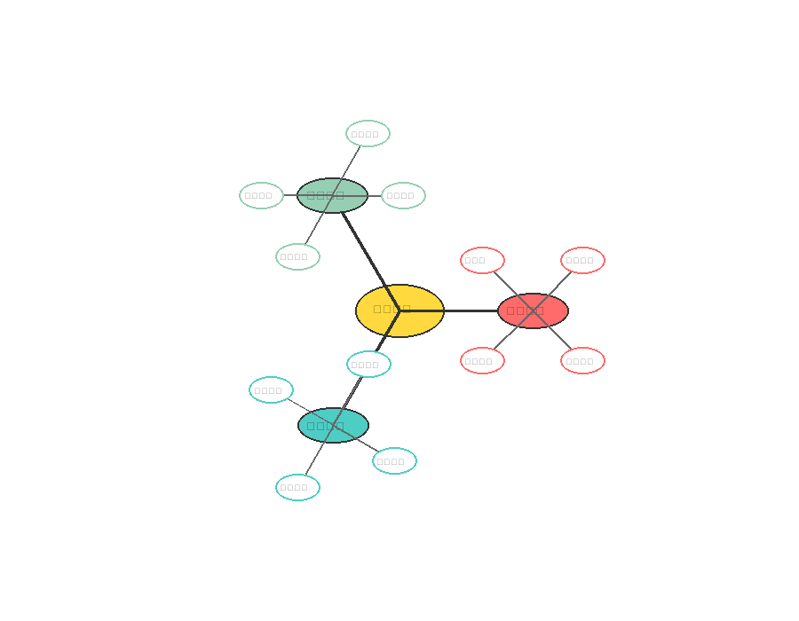

# 企业数字化转型全景指南

数字化转型已经成为现代企业发展的**必然趋势**。本文将通过丰富的图表和实际案例，为您全面解析企业数字化转型的核心要素和实施路径。

---

## 数据驱动的决策分析

现代企业的成功离不开**数据的支撑**。通过科学的数据分析，我们能够更好地理解业务现状和发展趋势。

> 数据分析在企业决策中发挥着越来越重要的作用，各个业务指标的量化分析帮助管理层做出更加精准的战略决策。

## 市场份额与竞争格局

了解**市场份额分布**对于制定竞争策略至关重要。以下饼图展示了当前市场的竞争格局：

> 市场集中度的分析表明，虽然头部企业占据主导地位，但仍有足够的空间供新兴企业发展和创新。

---

## 项目实施时间规划

任何成功的数字化转型项目都需要**科学的时间规划**。以下时间线展示了典型的项目实施阶段：

> 合理的时间安排确保了项目能够按计划推进，同时为各个阶段预留了充足的缓冲时间。

## 业务流程优化

数字化转型的核心之一是**业务流程的重新设计和优化**。标准化的流程能够提高效率并减少错误：

> 通过流程的标准化和自动化，企业能够显著提升运营效率，同时确保服务质量的一致性。

---

## 技术架构设计

稳固的**技术架构**是数字化转型的基础。分层的架构设计确保了系统的可扩展性和维护性：

**分层架构的设计原则包括：**

- **前端界面**：提供用户友好的交互体验
- **API网关**：统一管理外部接口调用  
- **业务逻辑**：实现核心业务功能
- **数据存储**：确保数据的安全和一致性

## 网络基础设施

可靠的网络基础设施是数字化系统正常运行的保障：

网络设计需要考虑：
- 高可用性和冗余机制
- 安全防护和访问控制
- 性能优化和负载均衡
- 监控和故障快速恢复

## 产品竞争力分析

在激烈的市场竞争中，全面了解产品的竞争优势和劣势至关重要：

多维度的对比分析帮助企业：
- 识别产品优势和改进空间
- 制定差异化竞争策略
- 优化资源配置和投入重点

## 战略思维导图

系统性的战略思考需要全局视野和结构化思维：

思维导图的价值：
- 梳理复杂问题的内在逻辑
- 促进团队协作和知识共享
- 提供决策支持和执行指导

## 运营监控仪表板

实时的运营监控是确保系统稳定运行的关键：

完善的监控体系包括：

### 关键指标监控
- **在线用户数**：反映系统活跃度
- **系统负载**：确保性能稳定
- **内存使用率**：预防资源瓶颈
- **响应时间**：优化用户体验

### 服务状态管理
- 实时健康检查
- 异常告警机制
- 故障自动恢复
- 性能趋势分析

## 数字化转型的关键成功因素

基于实践经验，企业数字化转型的成功需要关注以下几个关键要素：

### 1. 领导层承诺
- 明确的数字化战略
- 充足的资源投入
- 持续的变革推动

### 2. 组织能力建设
- 数字化人才培养
- 跨部门协作机制
- 学习型组织文化

### 3. 技术基础设施
- 现代化的IT架构
- 数据治理体系
- 安全保障机制

### 4. 用户体验优化
- 以客户为中心的设计理念
- 持续的用户反馈收集
- 快速迭代优化机制

## 实施建议与最佳实践

### 分阶段实施策略
1. **现状评估**：全面了解现有系统和流程
2. **试点先行**：选择关键业务进行小规模试点
3. **逐步推广**：基于试点经验扩大实施范围
4. **持续优化**：建立长期的改进和创新机制

### 风险管控措施
- 制定详细的风险管理计划
- 建立应急响应机制
- 定期评估和调整策略
- 加强安全和合规管理

## 总结与展望

**数字化转型**是一个持续的过程，需要企业在战略、组织、技术和文化等多个维度进行系统性的变革。

> 成功的数字化转型不仅能够提升企业的运营效率，更能够为企业创造新的商业价值和竞争优势。

面向未来，企业需要保持**开放的心态**，积极拥抱新技术和新模式，在变化中寻找机遇，在创新中实现发展。

---

**核心要点总结：**

1. **数据驱动决策** - 构建完善的数据分析体系
2. **流程标准化** - 优化业务流程提升效率  
3. **技术架构升级** - 建设稳固的技术基础
4. **持续监控优化** - 建立实时监控机制

*本文通过多种可视化图表，全面展示了企业数字化转型的各个维度和关键要素。希望能够为正在进行或计划进行数字化转型的企业提供有价值的参考和指导。*