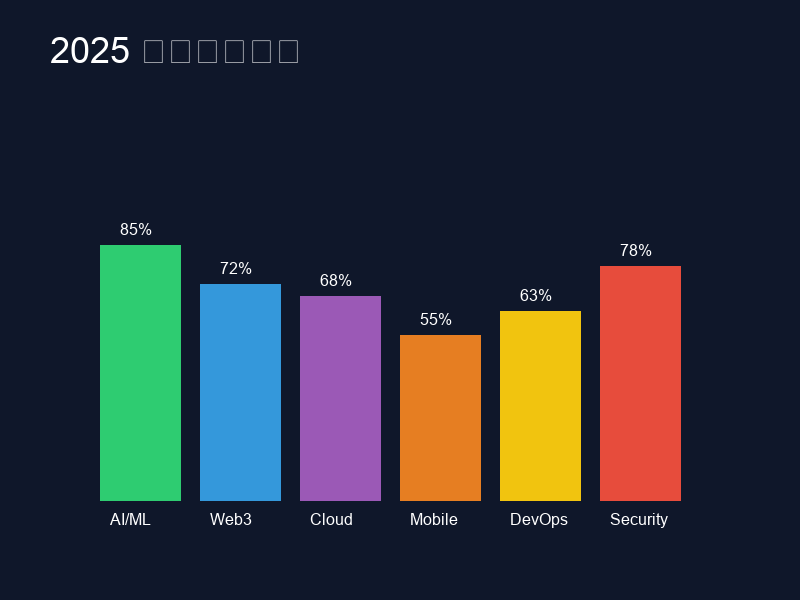
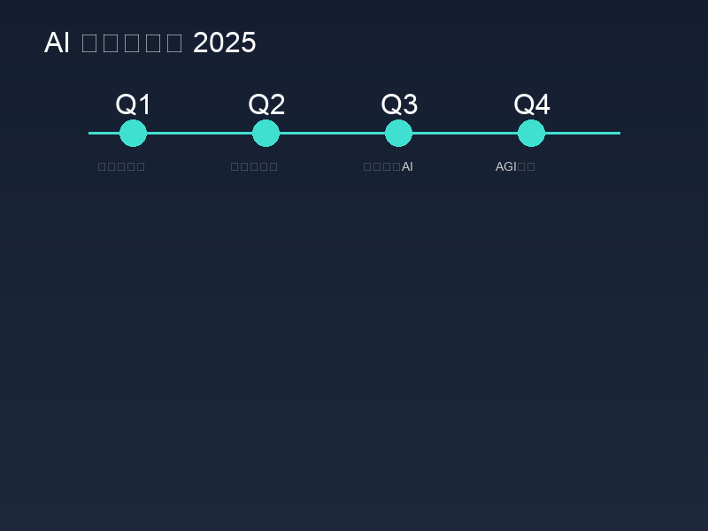
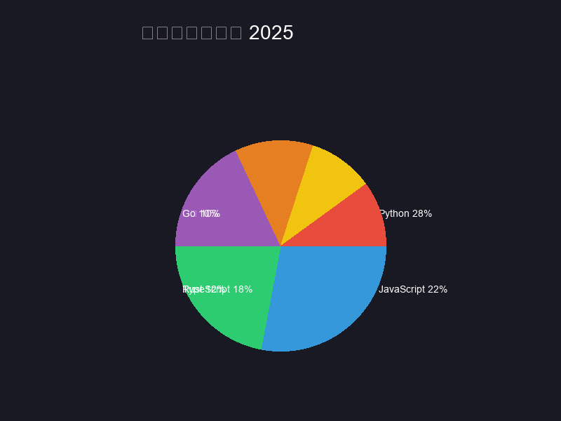
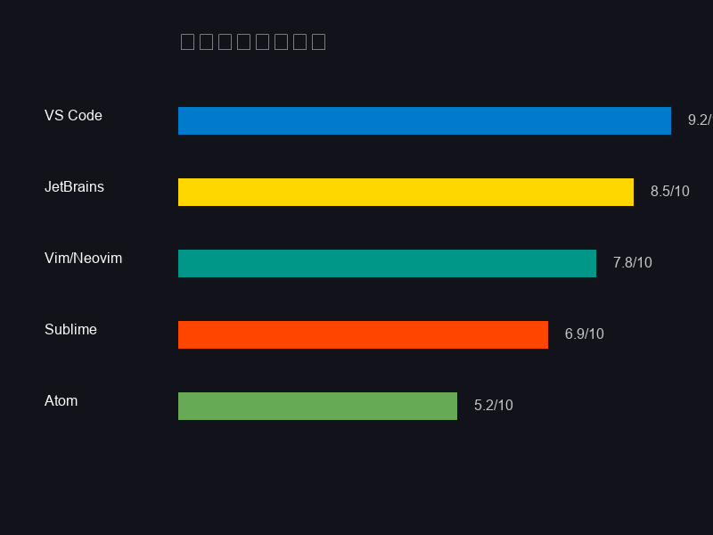
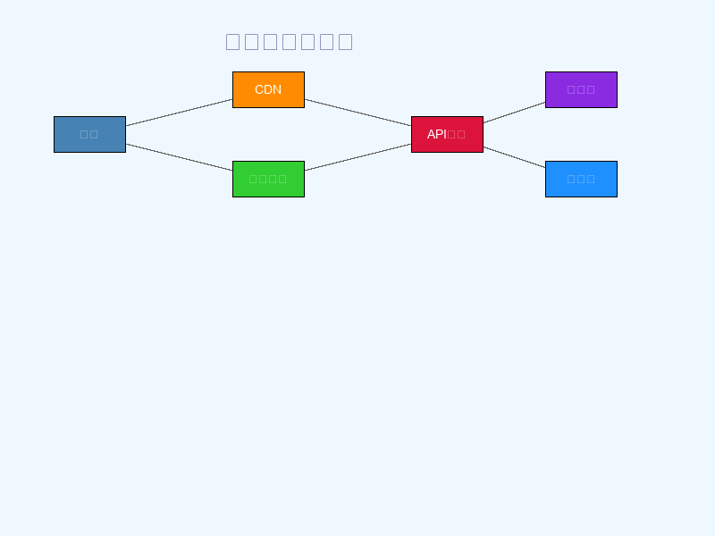
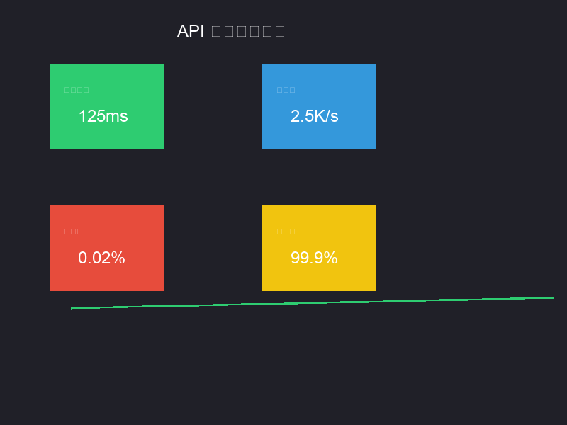
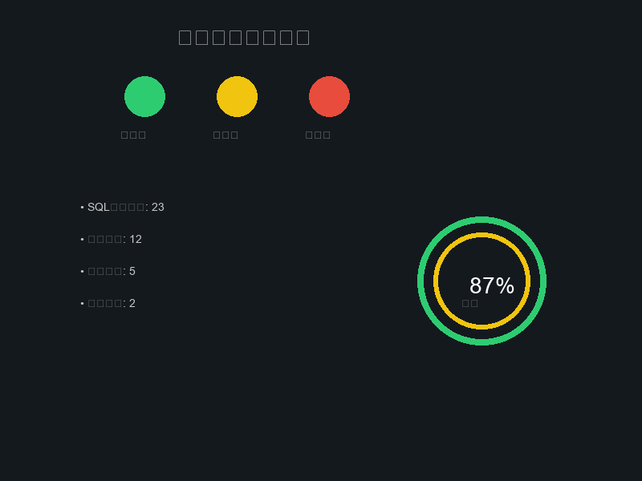
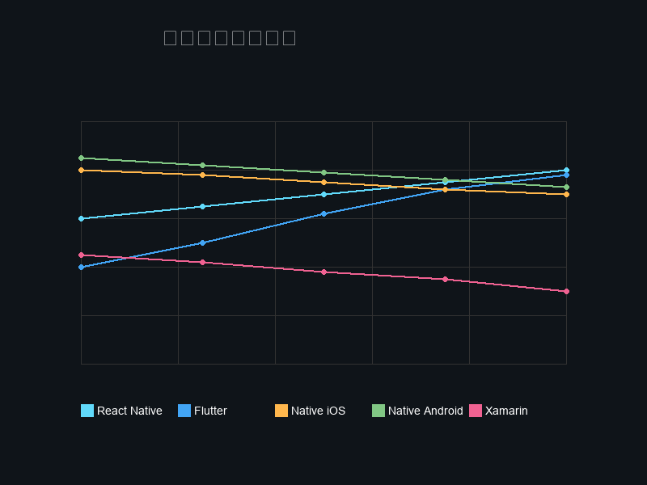
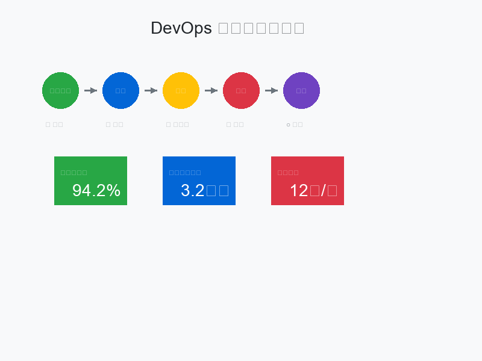
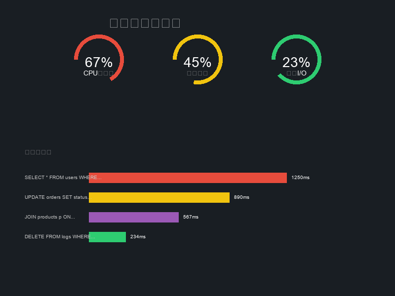

# 开发者日报 #3：AI 时代的技术变革与机遇

## 本期导读

2025年1月28日，技术世界继续快速演进。本期日报将聚焦AI驱动的开发工具革命、云原生架构的新趋势，以及移动开发生态的最新变化。

作为开发者，我们正处在一个激动人心的时代。人工智能不再只是概念，而是实实在在改变着我们的开发方式。从代码自动补全到架构设计建议，AI正在成为每个程序员的得力助手。

## 技术趋势分析

2025年最值得关注的技术趋势中，AI/ML以85%的关注度位居榜首。这不仅体现在机器学习模型的突破，更体现在AI工具对日常开发工作的深度渗透。

**关键观察：**
- AI/ML技术栈成为必备技能
- Web3虽然热度有所回落，但基础设施日趋成熟
- 云原生技术进入稳定应用期
- 移动开发向跨平台解决方案集中

## AI发展路线图

今年AI技术发展呈现明显的阶段性特征：

**Q1 大模型优化期**：各大厂商集中优化现有模型的推理效率和成本控制。GitHub Copilot、Cursor等AI编程工具的用户体验显著提升。

**Q2 多模态融合**：文本、图像、音频、视频的多模态AI应用将大规模落地。对于开发者来说，这意味着更丰富的API和工具选择。

**Q3 边缘计算AI**：AI推理能力下沉到移动设备和边缘节点，为实时AI应用创造新的可能性。

**Q4 AGI突破**：通用人工智能在特定领域的突破性进展，可能重新定义软件开发的方式。

## 编程语言生态

Python继续稳居最受欢迎编程语言榜首，占比28%。这主要得益于AI/ML领域的蓬勃发展。JavaScript和TypeScript紧随其后，分别占据22%和18%的份额。

**值得注意的变化：**
- Rust增长势头强劲（12%），在系统编程和Web后端领域获得更多认可
- Go保持稳定增长（10%），云原生生态的首选语言
- 传统语言如Java、C++的份额有所下降，但在特定领域仍不可替代

## 开发工具对比

开发工具生态正在经历AI化改造：

- **VS Code（9.2/10）**：凭借丰富的AI插件生态继续领跑
- **JetBrains系列（8.5/10）**：AI Copilot集成度不断提升
- **Vim/Neovim（7.8/10）**：通过插件生态拥抱AI时代
- **新兴工具**：Cursor、Windsurf等AI原生编辑器开始崭露头角

## 现代云架构演进

云原生架构正在向更加智能化和自动化的方向发展：

**架构特点：**
- 边缘CDN节点智能路由
- API网关集成AI安全防护
- 微服务间通信自动优化
- 数据库智能调优成为标配

**关键技术：**
- Kubernetes + Istio服务网格
- Serverless Functions普及应用
- 多云和混合云策略成熟
- 可观测性工具链完善

## API性能监控

API性能监控已经从被动监控转向主动优化：

- **响应时间**：平均125ms，通过智能缓存和CDN优化
- **吞吐量**：2.5K请求/秒，满足高并发业务需求
- **错误率**：控制在0.02%以下，自动故障转移机制
- **可用性**：99.9%，多活部署保障业务连续性

现代API设计不仅要考虑功能实现，更要在设计阶段就考虑可观测性、可扩展性和安全性。

## 网络安全新态势

2025年网络安全威胁呈现新的特点：

**主要威胁类型：**
- SQL注入尝试仍然是最常见的攻击方式（23次/日）
- 暴力破解攻击有所增加（12次/日）
- 异常访问模式需要重点关注（5次/日）
- 恶意文件上传防护效果显著（仅2次/日）

**防护建议：**
- 部署AI驱动的异常检测系统
- 实施零信任网络架构
- 定期进行安全渗透测试
- 建立完善的应急响应机制

## 移动开发技术选型

移动开发生态继续向跨平台方案倾斜：

**趋势分析：**
- **React Native**：生态成熟度持续提升，Facebook、Instagram等大型应用的成功案例
- **Flutter**：Google大力推广，性能优势明显，增长势头最为强劲
- **原生开发**：虽然份额下降，但在高性能场景仍不可替代
- **Xamarin**：微软战略调整，市场份额持续萎缩

选择移动开发技术栈时，需要平衡开发效率、性能要求和团队技能储备。

## DevOps持续集成

现代DevOps实践正在向智能化方向发展：

**流水线优化：**
- 代码提交触发自动化构建
- 智能测试策略减少测试时间
- 蓝绿部署确保零停机更新
- 实时监控和自动回滚机制

**关键指标：**
- 构建成功率：94.2%（行业领先水平）
- 平均构建时间：3.2分钟（持续优化中）
- 部署频率：12次/天（支持快速迭代）

CI/CD不再只是工具链的搭建，更是开发文化和工程实践的体现。

## 数据库性能优化

数据库性能监控和优化已经成为系统稳定性的关键环节：

**性能指标：**
- CPU使用率67%：处于合理范围，需关注峰值时段
- 内存使用45%：缓存命中率良好，有优化空间
- 磁盘I/O 23%：SSD升级效果显著

**慢查询优化：**
- 复杂JOIN查询优化是重点
- 索引策略需要定期review
- 读写分离架构效果明显
- 缓存层设计至关重要

## 本周精选文章

### 1. 《大模型时代的软件架构设计》

随着AI模型推理成本的大幅降低，软件架构设计面临新的挑战和机遇。如何在传统的分层架构中集成AI能力？如何处理AI服务的延迟和可靠性问题？本文深入探讨了AI原生应用的架构设计模式。

### 2. 《TypeScript 5.4的突破性特性》

TypeScript 5.4带来了许多令人兴奋的新特性，包括更强大的类型推导、改进的错误提示和性能优化。对于大型TypeScript项目来说，这些更新将显著提升开发体验。

### 3. 《云原生安全最佳实践2025》

容器化和微服务架构带来灵活性的同时，也引入了新的安全挑战。本文总结了2025年云原生安全的最佳实践，包括容器镜像扫描、服务网格安全配置、密钥管理等关键环节。

## 开源项目推荐

### 1. AI代码助手框架
一个轻量级的AI代码生成框架，支持多种编程语言，可以轻松集成到现有的开发工具中。

### 2. 微服务监控平台
基于OpenTelemetry的分布式系统监控解决方案，提供完整的链路追踪和性能分析能力。

### 3. 跨平台UI组件库
React Native和Flutter通用的UI组件库，帮助开发者快速构建一致的用户界面。

## 技术资源

### 学习资源
- 《深入理解Kubernetes原理》在线课程
- MIT开源的机器学习系统设计教材
- Google Cloud架构最佳实践指南

### 工具推荐
- **k9s**：Kubernetes集群管理利器
- **bruno**：API测试和文档工具
- **bun**：快速的JavaScript运行时

### 技术会议
- **KubeCon 2025**：云原生技术峰会
- **AI Dev Summit**：AI开发者大会
- **React Conf 2025**：React生态大会

## 写在最后

技术的发展速度从未像今天这样快速。作为开发者，我们既要保持对新技术的敏感度，也要在实践中保持理性。不是每一个新技术都需要立即跟进，但每一个趋势都值得我们思考。

AI时代的到来并不意味着程序员会失业，相反，它为我们创造了更多可能性。学会与AI协作，将是未来开发者的核心竞争力。

关注技术本质，拥抱变化，这是我们在这个快速变化时代的生存之道。

---

**关于投稿**：如果你有好的技术文章、开源项目或技术见解想要分享，欢迎投稿。让我们一起构建更好的开发者社区。

**订阅提醒**：本日报每周更新，关注我们不错过任何重要的技术动态。

---

*开发者日报由技术爱好者维护，内容仅供参考，投资需谨慎。*